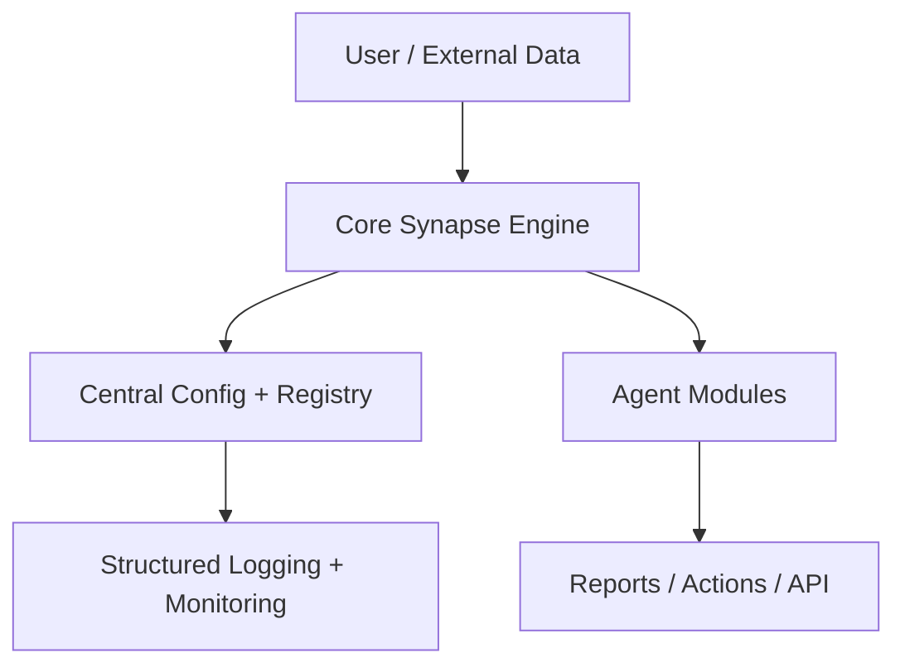

# synapse-system-pro

[](https://github.com/YOUR_USERNAME/synapse-system-pro/actions/workflows/ci.yml)  
[](https://hub.docker.com/r/YOUR_USERNAME/synapse-system-pro)  
[](LICENSE)  

---

## Overview

**synapse-system-pro** is a hardened fork of the original `synapse-system` project.  
The goal: keep the innovative **agent-driven architecture** while making it **production-grade** with centralized configuration, model registries, and enterprise ergonomics.

---

## 🚀 What’s New in Pro Fork

- Centralized config & secrets (no hardcoding)  
- Model registry with version pinning + fallback chains  
- Structured logging (JSON + human-readable)  
- CI/CD pipeline (GitHub Actions)  
- Dockerized deployment for reproducibility  

---

## 🔧 Architecture



---

## Table of Contents

- [Core Components](#core-components)  
- [Agent Infrastructure](#agent-infrastructure)  
- [Knowledge Engine](#knowledge-engine)  
- [CLI Usage](#cli-usage)  
- [Development & Testing](#development--testing)  
- [Roadmap](#roadmap)  
- [Contributing](#contributing)  
- [License](#license)  

---

## Core Components

### 1. Unified CLI (`bin/synapse`)  
- Single entry point for all Synapse functionality  
- Context-sensitive command routing  
- Manages both project-local and global operations  

### 2. Project Manager (`lib/project.py`)  
- Handles project initialization and agent deployment  
- Manages configuration and environment setup  

### 3. Update Manager (`lib/updater.py`)  
- Manages agent and system updates, rollback, and version checks  

### 4. Version Manager (`lib/version_manager.py`)  
- Tracks agent versions, file checksums, and manifest integrity  

### 5. Knowledge Engine (`.synapse/neo4j/`)  
- Provides semantic, graph, and hybrid (vector+symbolic) search  
- Powers standards, templates, and contextual recommendations  

---

## Agent Infrastructure

Agents are the automation building blocks in Synapse.  
Each agent is a self-contained Python package with modular tool support, inter-agent communication, and integrated knowledge access.

### Agent Directory Structure

```
.synapse/agents/{agent-name}/
├── {agent_name}_agent.py
├── {agent_name}_prompt.md
├── {agent_name}_config.yml
├── {agent_name}_state.json
└── tools/
    ├── __init__.py
    ├── {domain}_tools.py
    ├── synapse_integration.py
    ├── agent_communication.py
    └── mock_sdk.py
```

#### Agent Types  
- Universal Agents — cross-language automation  
- Language Specialists — enforce language-specific norms  
- Utility Agents — support, compression, diagnostics  

#### Features  
- Async event loop  
- @tool-decorated functions  
- Dynamic tool loading  
- Rich inter-agent protocol  

---

## Knowledge Engine

- Location: `.synapse/neo4j/`  
- Components: Neo4j Graph DB, Redis cache, BGE-M3 vector engine  
- Capabilities: hybrid search, standards retrieval, contextual recommendations  

---

## CLI Usage

```bash
synapse init .
synapse search "code review"
synapse start
synapse health
synapse manifest verify
```

---

## Development & Testing

```bash
git clone <repo-url>
cd synapse-system
cd .synapse/neo4j
python -m venv .venv
source .venv/bin/activate
pip install -r requirements.txt
docker-compose up -d
python bin/synapse version
```

Testing:

```bash
cd .synapse/neo4j
python -m pytest tests/
./test-integration.sh
python lib/version_manager.py verify
```

---

## Roadmap (Pinned Issues)

- Refactor config & secrets  
- Implement fallback chain  

---

## Contributing

See [DEVELOPMENT.md](DEVELOPMENT.md) for full technical details.

---

## License

MIT License. See [LICENSE](LICENSE).  
